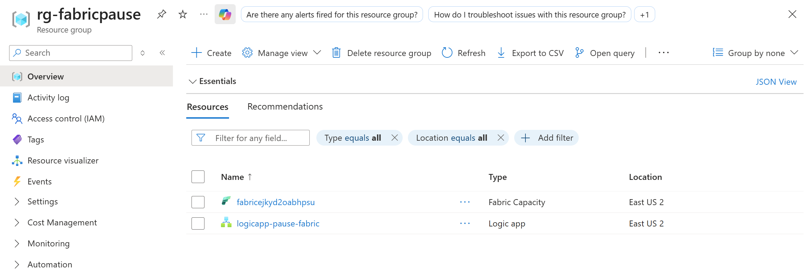
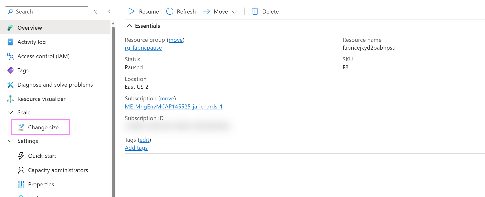

[comment]: <> (this is the section for the Note: item; please do not make any changes here)
***
### Microsoft Fabric Capacity with Auto-Pause Logic App

**Note:** Below demo steps should be used **as a guideline** for doing your own demos. Please consider contributing to add additional demo steps.

[comment]: <> (this is the section for the Tip: item; consider adding a Tip, or remove the section between 
 and 
 if there is no tip)

***
### 1. What Resources are getting deployed
<add a one-paragraph lengthy description of what the scenario is about, and what is getting deployed>

Provide a bullet list of the Resource Group and all deployed resources with name and brief functionality within the scenario. 

* rg-%azdenvironmentname - Azure Resource Group.
* Fabric%uniquestring% - Microsoft Fabric Capacity (F8 SKU)
* LogicApp-Pause-Fabric - Azure LogicApp to pause the Fabric Capacity (to save cost; runs every 4 hours UTC)

### 2. What can I demo from this scenario after deployment

This capacity size should allow for most sample data scenarios in any Fabric workload (Analytics, Engineering, ML, Reporting)

## DEMO GUIDE

### Contents

#### Validate Deployed Resources

- Fabric Capacity (F8 SKU)
- Logic App - Fabric Capacity Pause - pauses capacity every 4 hours (UTC). This may not be running on creation - go into Overview of resource and select `Resume` to initialize

#### Adding Your Fabric Capacity to a Workspace

- Create a Fabric Workspace

  - Navigate to https://app.powerbi.com/

  

- Fill in the fields (Domain not needed) - ensure that under Advanced section, that created F8 Fabric Capacity is selected

  

#### Resizing Capacity

- If you find costs are too high or processing is running slower than expected based on Trial F64, you can always navigate back to the Azure resource and resize at any SKU at any time.

#### Pause Capacity and Reset Logic App Timer

- If you want to run the logicapp trigger and reset the 4 hour timer, navigate to the logicapp resource and select `Run`

#### Change Pause Frequency

- If you want to change how often the logicapp pauses:
1. Navigate to logicapp and select `Logic App Designer`
2. Select the `Every 4 Hours` Step
3. Change the Frequency settings

